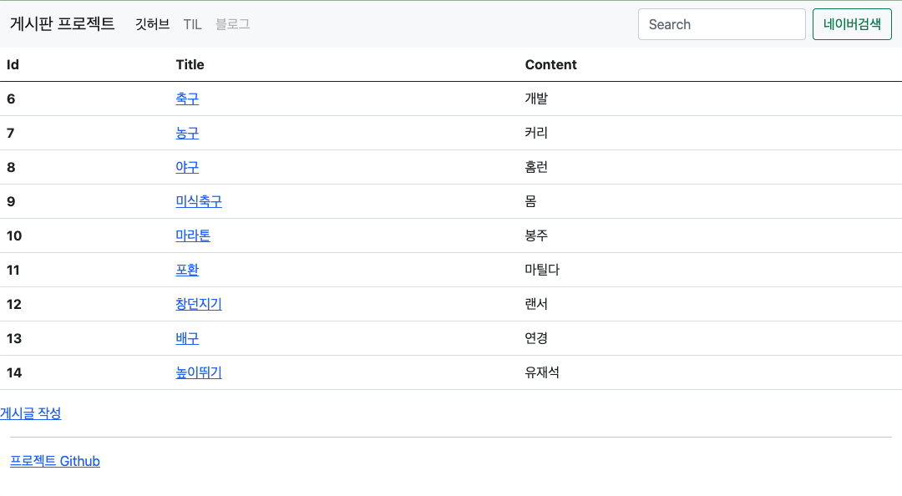
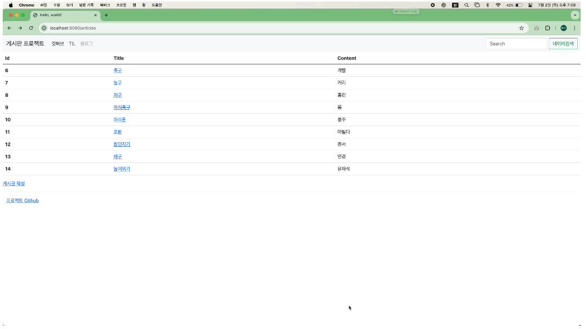
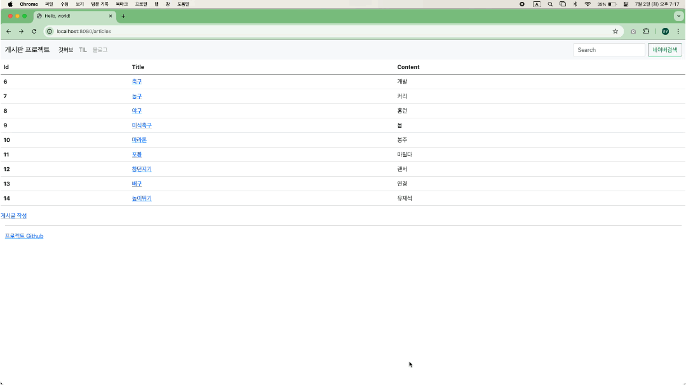
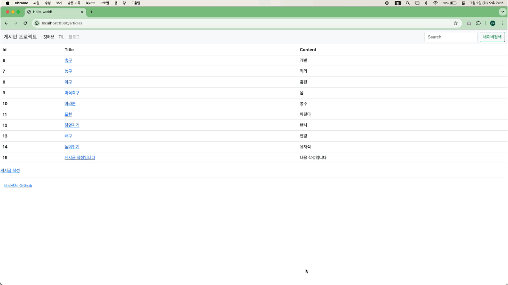
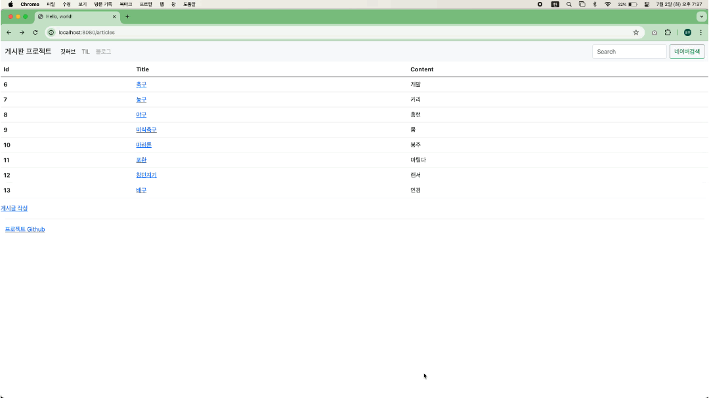
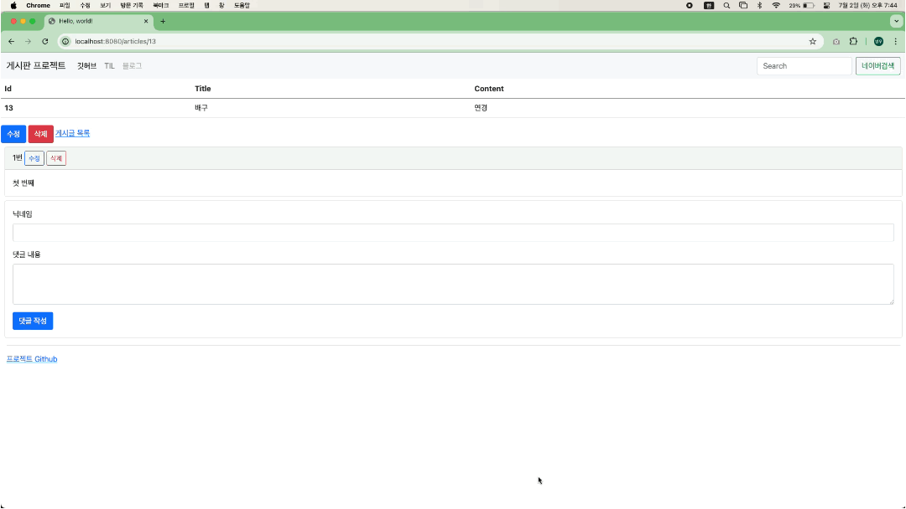
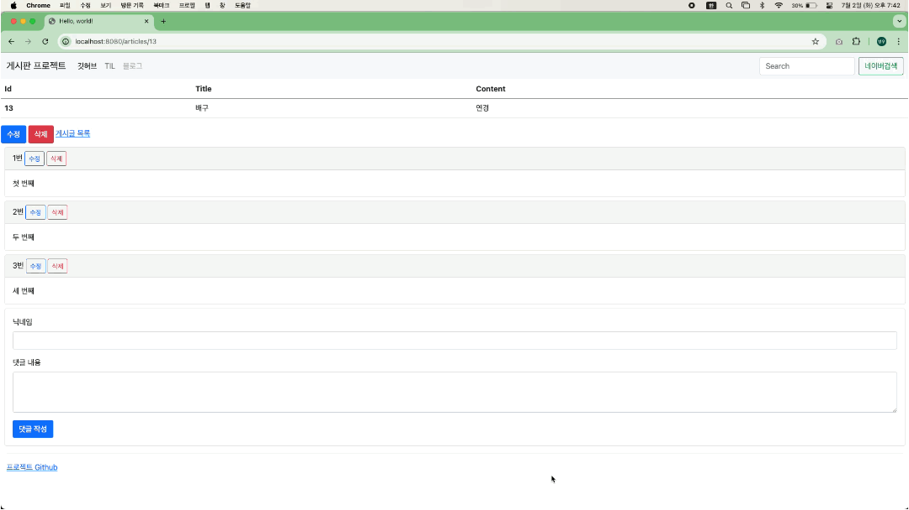
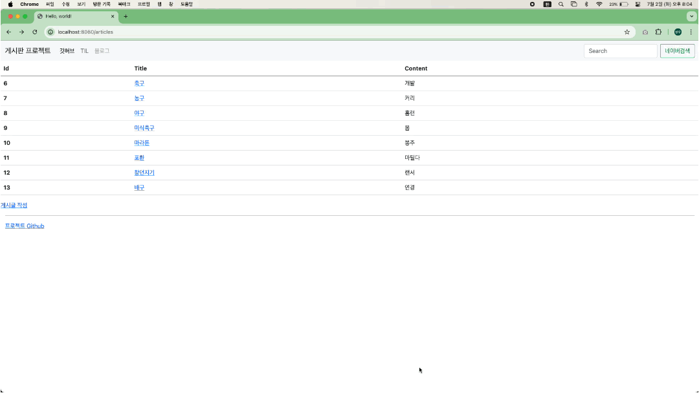
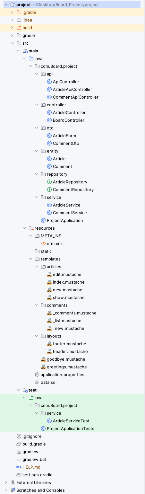

# Board_Project
**게시판 프로젝트**

## 목차
[1. 프로젝트 소개](#1-프로젝트-소개)    
[2. 프로젝트 기능](#2-프로젝트-기능)    
[3. 개발환경](#3-개발환경)   
[4. 백엔드](#4-백엔드)   
[5. 프론트엔드](#5-프론트엔드)   
[6. 실행 화면](#6-실행-화면)   

[구조 및 설계](#구조-및-설계)

### 1. 프로젝트 소개
웹 개발의 중심인 게시판을 직접 만들어 웹에 대한 이해를 높이는 것에 중점을 둔 프로젝트

### 2. 프로젝트 기능
**게시판**: CRUD 기능, 조회수, 페이징 및 검색 처리  
**댓글**: CRUD 기능  
**테스트코드**

### 3. 개발환경
- Java 17
- Gradle(Groovy)
- SpringBoot 3.3.1
- Dependencies(Spring Web, H2 Database, Mustache, Spring Data JPA, PostgreSQL)

### 4. DataBase
- H2 Database -> PostgreSQL

### 5. 프론트엔드
- Html
- Css
- JavaScript
- Mustache(Template)
- Bootstrap 5.0.2

### 6. 실행 화면
  

    
게시글
   
       
    
  **1. 게시글 전체 목록**   
     
   
     
  **2. 게시글 작성**   
     
     
  **3. 게시글 상세보기**   
     
     
   **4. 게시글 수정 화면**     
        
  
  **5. 게시글 삭제 화면**   
     
  게시글 삭제 후 `삭제 완료` 알림 창 발생   
  
  

      
  
  

    
댓글 관련
   
       
  **1. 댓글 작성**       
     
  `댓글 등록 완료` 알림 발생
  
  **2. 댓글 수정**   
     
  `댓글 수정 완료` 알림 발생

  **3. 댓글 삭제**   
     
  `n번 댓글 삭제 완료` 알림 발생  
           
  

      

  

    
그 외
   

        
  
  

   

## 구조 및 설계   

  
